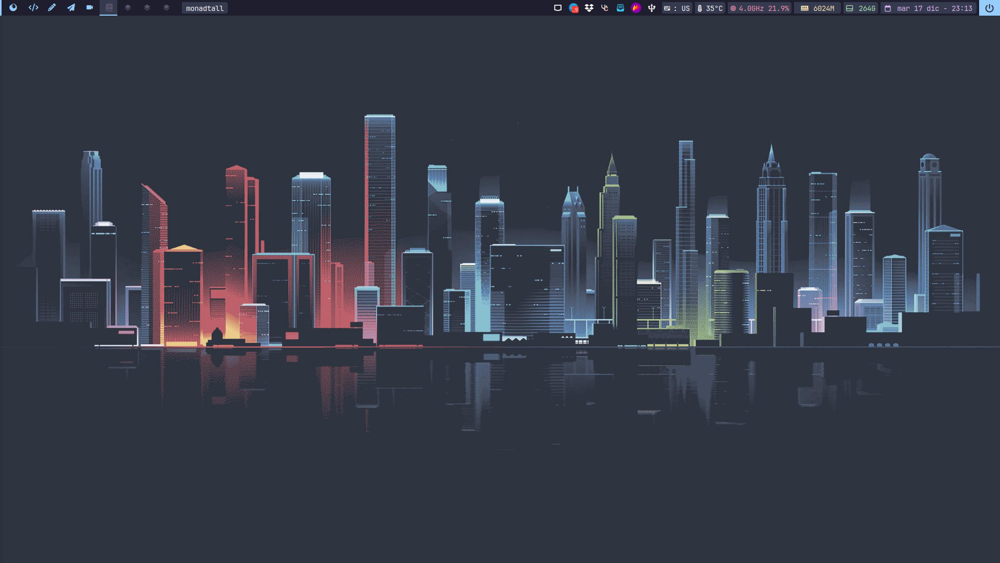

# My Dotfiles



## Configuration

- Window Manager: [qtile](https://github.com/vcntttt/dotfiles/tree/main/.config/qtile)
- Terminal: [alacritty](https://github.com/vcntttt/dotfiles/tree/main/.config/alacritty)
- Terminal Editor: [AstroNvim](https://astronvim.com/)
- Launch Menu: [rofi](https://github.com/vcntttt/dotfiles/tree/main/.config/rofi)
- Terminal File Manager: [yazi](https://github.com/vcntttt/dotfiles/tree/main/.config/yazi)

## Installation

### Requirements

```bash
  sudo pacman -S git stow
```

### Installation

```zsh
cd ~
git clone https://github.com/vcntttt/dotfiles.git
cd dotfiles
stow .
```

## Keybindings

### System

| Key | Action |
| ---- | ---- |
| mod + backspace | powermenu |
| mod + space | change layout |
| mod + Tab | view open apps |

### Launch

| Key | Application |
| ---- | ---- |
| mod + Return | warp-terminal|
| mod + shift + Return | rofi |
| mod + shift + e | nemo |
| mod + v |  clipboard |
| Print | screenshot |
| mod + . | emoji menu |

### Scratchpads

| Key | Application |
| ---- | ---- |
| mod + n | alacritty |
| mod + b | btop |
| mod + e | ranger |
| mod + s | spotify |
| mod + p | pavucontrol |
| mod + shift + p | pomodoro |

## Alias

### Git

| Alias | Command |
| ---- | ---- |
| gs | git status|
| ga | git add|
| gc | git commit|
| gca | git commit -a -m|
| gb | git branch|
| gch | git checkout|
| gl | git pull|
| gp | git push|

<!-- ### Development

| Alias | Command |
| ---- | ---- |
| viteinit | bunx create-vite@latest|
| astroinit | bunx create astro@latest|
| nextinit | bunx create-next-app@latest|
| bund | bun run dev |
| buni | bun install |
| bunb | bun run build | -->
